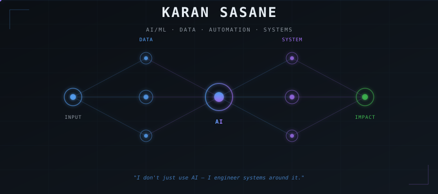
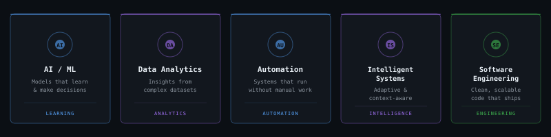
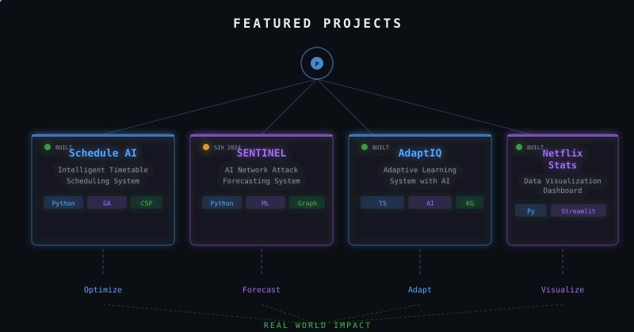
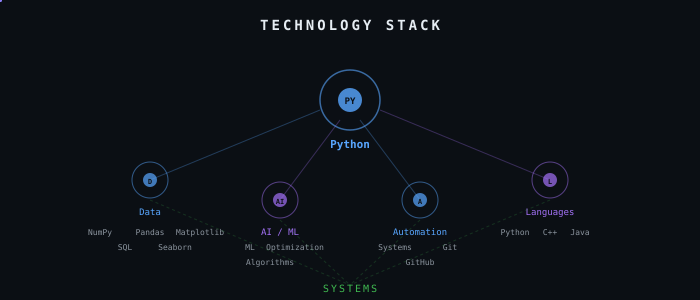
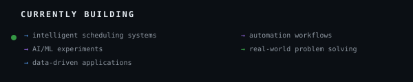
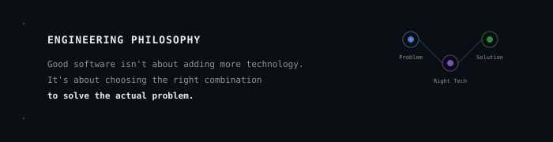

<!-- Hero Banner -->

 

<!-- Typing Animation -->

---

 

<!-- Terminal Animation -->

 

---

## About

I build intelligent systems at the intersection of AI, data, and software.

Currently exploring how algorithms, automation, and machine learning can turn messy real-world problems into systems that actually work.

 

---

## What I Build

 

---

## Featured Projects

 

<table>
<tr>
<td align="center" width="50%">

### Schedule AI

Intelligent college timetable scheduling system built around constraint satisfaction and optimization.

**Stack:** Python · Genetic Algorithms · CSP · AI Parsing

**Concepts:** Scheduling · Optimization · Conflict Prevention · Professor Availability

 

</td>
<td align="center" width="50%">

### SENTINEL

SIH26153 — AI-Based Network Attack Forecasting from Network Traffic Data. An offline, explainable temporal cyber-defence prototype.

**Stack:** Python · ML · Graph Reasoning · Temporal Analysis

**Concepts:** Attack Forecasting · Explainability · Threat Intelligence · Tamper-Evident Evidence

</td>
</tr>
<tr>
<td align="center">

### AdaptIQ

Adaptive learning system using knowledge graphs, learner diagnosis, and AI assistance to personalize education.

**Stack:** TypeScript · AI · Knowledge Graphs

**Concepts:** Adaptive Learning · Learner Diagnosis · AI Companion · Learning Analytics

</td>
<td align="center">

### Netflix Stats Explorer

Interactive data visualization dashboard showcasing insights from Netflix's content catalog using Python.

**Stack:** Python · Pandas · Matplotlib · Streamlit · Plotly

**Concepts:** Data Visualization · Trend Analysis · Interactive Dashboards

</td>
</tr>
</table>

 

---

## Technology Stack

 

---

## Currently Building

 

---

## GitHub Statistics

<!-- Stats Card -->

&nbsp;&nbsp;

<!-- Top Languages -->

 

---

## Contribution Activity

<!-- GitHub Streak -->

 

---

## Engineering Philosophy

 

---

## Open Source Contributions

<!-- Contribution Snake (auto-generated by GitHub Actions) -->

 

---

## Connect

 

---

<!-- Status Loop -->

