


---


---

## What I Build

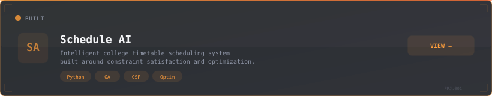

 

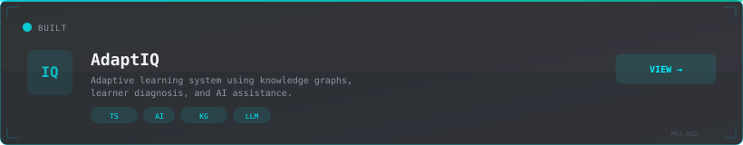

 

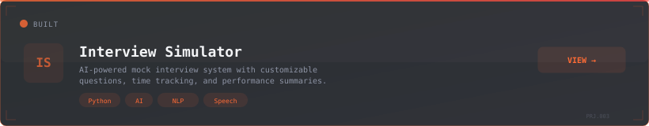

 

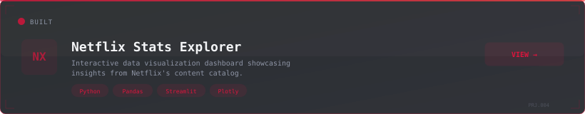

 

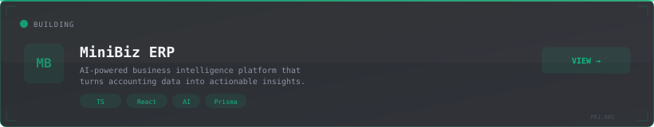

---

## Technology Matrix


---

## Current Telemetry

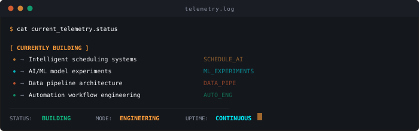

---

## GitHub Telemetry


<!-- Dynamic GitHub Stats -->

&nbsp;&nbsp;

<!-- Top Languages -->

<!-- Streak Stats -->

---

## Contribution Activity

<!-- Snake Animation — auto-generated by GitHub Actions -->

---

## System Loop

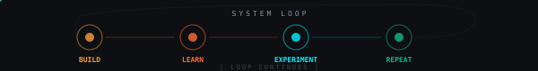

---

## Connect

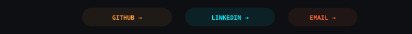

